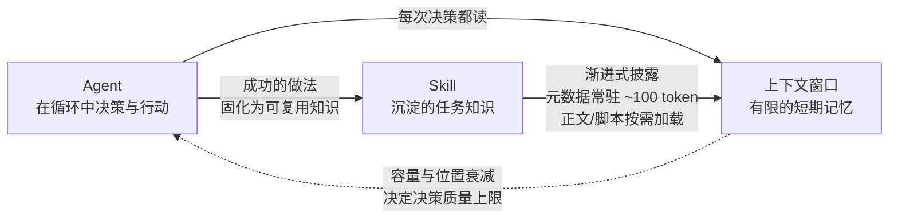

# 三个概念的关系：Agent · 上下文 · Skill

> 三份学习资料：[agent.html](agent.html) · [llm-context.html](llm-context.html) · [skill.html](skill.html)

## 一句话总览

**Agent 是在循环中干活的工人，上下文是它唯一的"工作台"（有限大小），Skill 是预先整理好的工具手册——按需摆上工作台，不占地方。**

## 关系图

## 三者角色对照

| 概念 | 在系统中的角色 | 类比 | 关键约束 |
|------|--------------|------|----------|
| Agent | 执行者：在环境反馈循环中自主决策、调用工具 | 干活的工人 | 自主性 = 延迟 + 成本；错误会累积 |
| 上下文 | 工作台：每次决策唯一可见的信息源 | 桌面白板 | 容量有限；中间位置利用率低（Lost in the Middle）；每轮重发、按量计费 |
| Skill | 知识库：打包的程序性知识与工作流 | 装了标签的抽屉 | 靠 description 触发；正文 < 5000 token；脚本不进上下文 |

## 上下文如何影响 Agent 的工作

1. **上限**：Agent 每一步决策只能基于上下文里的内容——系统提示、对话历史、工具结果。装不进上下文的知识，Agent 就"不知道"。
2. **衰减**：上下文越长不是越好——研究证实中间位置的信息利用率显著下降（[Lost in the Middle, Liu et al. 2023](https://arxiv.org/abs/2307.03172)）。Agent 长程任务中"忘了最初的指令"，多半是这个原因。
3. **成本**：历史每轮重发，token 按量计费。Agent 循环几十步，上下文管理直接决定任务可行性与花费（[Lilian Weng, 2023](https://lilianweng.github.io/posts/2023-06-23-agent/)：上下文即短期记忆，长期记忆需外部存储）。

## Skill 如何沉淀可复用的任务知识

1. **固化经验**：把成功做法、常见错误、操作规范写成 SKILL.md 的指令——就像把"老员工脑中的诀窍"写成入职手册（[Anthropic 工程博客](https://www.anthropic.com/engineering/equipping-agents-for-the-real-world-with-agent-skills)建议的第 4 条最佳实践：与 Agent 共同迭代，把有效做法捕获为 Skill）。
2. **按需注入**：Skill 用渐进式披露把知识"挂载"到上下文——启动时只占约 100 token 的元数据，任务匹配时才读正文，脚本甚至完全不进上下文。知识存量可以很大，上下文占用却很小。
3. **跨会话复用**：上下文随会话消失，Skill 是文件夹、可版本控制——本仓库的 `concept-origin-study` 就是把本次学习流程固化成 Skill，供以后每个新概念复用。

## 串起来看

> Agent 循环干活 → 每一步都消耗有限的上下文 → Skill 把重复任务的知识沉淀成手册，以极小的上下文代价按需注入 → Agent 因此腾出宝贵的上下文去装"当前任务真正需要的信息"。

三个概念合起来，回答了同一个问题：**如何让通用模型在真实任务中持续可靠地工作。**

---

*本文档中所有技术断言均可在三份学习资料与对应原始出处中核查验证。*
